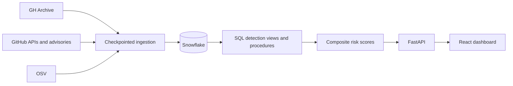

# Sentinel OSS

Sentinel OSS is an early-warning dashboard for open-source supply-chain risk. It combines GitHub activity, dependency metadata, GitHub Security Advisories, and OSV data to surface suspicious repository behavior and vulnerable packages.

The project runs locally in credential-free mock mode. Snowflake and GitHub credentials are optional and are needed only for live data.

## What it detects

- A new collaborator pushing code within 24 hours.
- One actor pushing across many repositories in a short window.
- Suspicious commit-message patterns linked to install hooks, obfuscation, credential access, or download-and-execute behavior.
- Repository dependencies whose resolved versions match GitHub Advisory or OSV affected ranges.
- A combined 0–100 risk score using a complement-product heuristic.

This is a triage tool, not an automatic vulnerability verdict. Findings should always be reviewed by a human.

## Tech stack

- **Frontend:** React 19, TypeScript, Vinext/Vite, Tailwind CSS, shadcn/ui, and Recharts.
- **Backend:** Python 3.11+, FastAPI, Pydantic, HTTPX, and Uvicorn.
- **Data and security:** Snowflake, GH Archive, GitHub APIs/SBOM, GitHub Advisory Database, and OSV.
- **Automation:** GitHub Actions for CI and scheduled ingestion.

## Snowflake technology used

In short, the implemented Snowflake path uses:

- tables for events, advisories, dependencies, checkpoints, and risk scores;
- `VARIANT` and `LATERAL FLATTEN` for semi-structured GitHub payloads;
- idempotent `MERGE` statements for checkpointed ingestion;
- SQL views and window functions for behavioral detection;
- stored procedures for score refresh, repository lookup, and dashboard summaries;
- separate warehouses, service users, and least-privilege roles for ingestion and read-only dashboard access;
- key-pair authentication from the FastAPI service.

The architecture also documents future extensions such as Cybersyn Marketplace history, Cortex explanations, CTAS feature tables, a SQL UDF, and Streamlit in Snowflake. These are not presented as implemented features.

## Run locally

### Prerequisites

- Node.js 22.13 or newer
- npm
- Python 3.11 or newer

### 1. Clone the repository

```powershell
git clone https://github.com/MaitraAmbalia/OSS_Early_detection-MLH.git
cd OSS_Early_detection-MLH
```

### 2. Start the backend

In the first PowerShell terminal:

```powershell
cd backend
py -3.11 -m venv .venv
.\.venv\Scripts\Activate.ps1
python -m pip install -e ".[dev]"
Copy-Item .env.example .env
python -m uvicorn app.main:app --reload --port 8000
```

Mock mode is enabled by default, so no external credentials are required. The API is available at `http://127.0.0.1:8000`, with interactive documentation at `http://127.0.0.1:8000/docs`.

### 3. Start the frontend

In a second PowerShell terminal, from the repository root:

```powershell
npm ci
Copy-Item .env.example .env.local
npm run dev
```

Open `http://localhost:5173`.

On macOS or Linux, use `python3 -m venv .venv`, `source .venv/bin/activate`, and `cp` instead of the PowerShell-specific commands.

## Environment variables

Never commit `.env`, `.env.local`, private keys, passwords, or tokens. The repository tracks only safe `.env.example` templates, and `.gitignore` excludes real environment files and `*.pem` keys.

### Frontend (`.env.local`)

| Variable | Required | Purpose |
| --- | --- | --- |
| `NEXT_PUBLIC_API_BASE_URL` | No | Backend URL; defaults to `http://127.0.0.1:8000`. |

### Backend (`backend/.env`)

| Variable | Required | Purpose |
| --- | --- | --- |
| `APP_ENV` | No | Runtime label: `development`, `test`, or `production`. |
| `DATA_MODE` | No | `mock` by default; set to `snowflake` for live data. |
| `CORS_ORIGINS` | No | Comma-separated allowed frontend origins. |
| `GITHUB_TOKEN` | No | Fine-grained, read-only token for higher GitHub API limits and ingestion. |
| `SNOWFLAKE_ACCOUNT` | Live mode | Snowflake organization/account identifier. |
| `SNOWFLAKE_USER` | Live mode | Dedicated Snowflake service user. |
| `SNOWFLAKE_PRIVATE_KEY_FILE` | Live mode | Absolute path to the service user's private key. |
| `SNOWFLAKE_PRIVATE_KEY_PASSPHRASE` | No | Passphrase when the private key is encrypted. |
| `SNOWFLAKE_ROLE` | Live mode | Read-only application role; defaults to `DASHBOARD_ROLE`. |
| `SNOWFLAKE_WAREHOUSE` | Live mode | Query warehouse; defaults to `HACKATHON_WH`. |
| `SNOWFLAKE_DATABASE` | Live mode | Database; defaults to `SUPPLY_CHAIN_MONITOR`. |
| `SNOWFLAKE_SCHEMA` | Live mode | Schema; defaults to `DETECTION`. |

Use repository secrets—not committed files—for the values referenced by `.github/workflows/ingest.yml`.

## Live Snowflake setup

1. Review and run `backend/sql/001_schema.sql` to create the data model.
2. Run `backend/sql/002_detection.sql` to create detection views and procedures.
3. Review `backend/sql/003_access.sql`, replace its example service-user names if needed, and run it with the appropriate administrative roles.
4. Register the service user's public key in Snowflake. Keep the private key outside the repository.
5. Copy `backend/.env.example` to `backend/.env`, set `DATA_MODE=snowflake`, and fill in the `SNOWFLAKE_*` values locally.
6. Add the Snowflake and GitHub values required by `.github/workflows/ingest.yml` as GitHub Actions repository secrets.

Run ingestion manually from `backend/` with:

```powershell
python -m app.cli ingest --sources all --lookback-hours 3
```

The scheduled workflow ingests GH Archive hourly and refreshes advisory data daily. Checkpoints and event IDs make repeated ingestion idempotent.

## Architecture



The repository currently implements live ingestion, Snowflake `MERGE` operations, advisory and SBOM enrichment, three behavioral detectors, dependency exposure matching, composite scoring, repository-risk and dashboard procedures, a FastAPI service, and the React analytics dashboard.

## Repository structure

```text
app/                  Frontend routes and layout
components/           Dashboard and shared UI components
lib/                  Frontend API client and utilities
backend/app/          FastAPI application, services, and ingestion
backend/sql/          Snowflake schema, detection logic, and RBAC
backend/tests/        Backend tests
.github/workflows/    CI and scheduled ingestion
```

## API endpoints

- `GET /health`
- `GET /api/v1/dashboard/overview`
- `GET /api/v1/findings?severity=critical&limit=50`
- `GET /api/v1/repositories/{owner}/{repo}/risk`
- `POST /api/v1/github/validate`
- `POST /api/v1/repositories/{owner}/{repo}/analyze`

For one-request GitHub analysis, the client may send a token in `X-GitHub-Token`. The backend does not persist or log that header.

## Validate changes

```powershell
npm run lint
npm run build

cd backend
python -m pytest
python -m ruff check .
```
