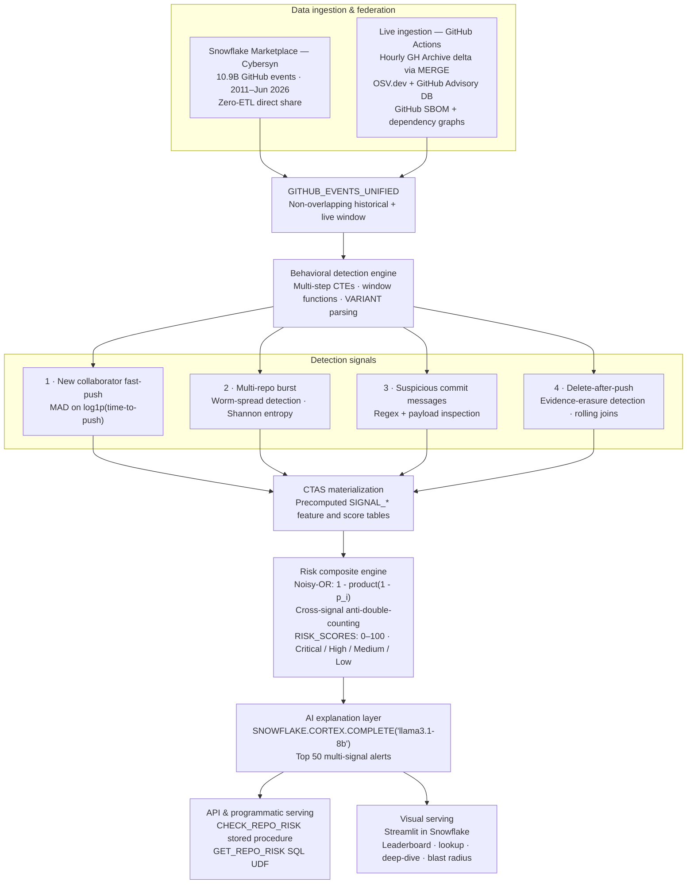

# Sentinel OSS

An OSS supply-chain early-warning board that correlates GitHub behavior with
dependency advisories in Snowflake.

## Architecture

The production design combines a long historical baseline with continuously
ingested public events. Historical and live records meet in one non-overlapping
view before detection, scoring, explanation, and serving.



### Implementation status

The diagram above is the target production architecture. The repository already
implements the live-ingestion path, checkpointed Snowflake `MERGE`, OSV and
GitHub advisory enrichment, GitHub SBOM analysis, three behavioral detectors,
complement-product risk scoring, `CHECK_REPO_RISK`, a FastAPI service, and the
React analytics dashboard.

The Cybersyn federation layer, robust MAD/entropy feature models,
delete-after-push signal, CTAS `SIGNAL_*` tables, Cortex explanations,
`GET_REPO_RISK` UDF, and Streamlit-in-Snowflake interface are production-path
extensions. This distinction keeps the deployable hackathon build accurate
while documenting how it scales into the full system.

## Repository

- `app/`, `components/`, `lib/` — analytics-focused React/Vinext dashboard
- `backend/` — FastAPI API, GitHub clients, ingestion jobs, and detectors
- `backend/sql/` — Snowflake schema, detection views/procedures, and grants
- `.github/workflows/` — CI and scheduled ingestion

## Local demo

The default is credential-free mock mode:

```powershell
cd A:\MLH\backend
Copy-Item .env.example .env
.\.venv\Scripts\python.exe -m uvicorn app.main:app --reload --port 8000

cd A:\MLH
Copy-Item .env.example .env.local
npm run dev
```

## Live Snowflake setup

1. Run `backend/sql/001_schema.sql`.
2. Run `backend/sql/002_detection.sql`.
3. Run `backend/sql/003_access.sql`.
4. Register the service user's public key.
5. Set `DATA_MODE=snowflake` and the `SNOWFLAKE_*` variables.
6. Add the secrets referenced by `.github/workflows/ingest.yml`.

The workflow ingests GH Archive every hour and GitHub/OSV advisory data daily.
Every source is checkpointed, GitHub event IDs are merged idempotently, and
dependency matches use npm SemVer or Python PEP 440 rules when applicable.

## Detection model

- collaborator added, followed by that actor pushing within 24 hours;
- ten or more distinct repositories pushed by one actor in a sliding hour;
- low-confidence commit-message patterns for install hooks, obfuscation,
  credential access, and download/execute behavior;
- resolved dependency versions that fall inside GHSA/OSV affected ranges.

Scores are combined as independent evidence using the complement product. This
is a ranking heuristic, not a claim of Bayesian probability. GitHub Archive has
commit messages but no file diffs, so suspicious-message evidence is capped and
always requires review.
